# [Wide-Context Semantic Image Extrapolation](http://jiaya.me/papers/imgextrapolation_cvpr19.pdf)
by [Yi Wang](https://shepnerd.github.io/), [Xin Tao](http://www.xtao.website), [Xiaoyong Shen](http://xiaoyongshen.me/), [Jiaya Jia](http://www.cse.cuhk.edu.hk/leojia/).

## Introduction
This repository gives the Tensorflow implementation of the method in CVPR 2019 paper, '[Wide-Context Semantic Image Extrapolation](http://jiaya.me/papers/imgextrapolation_cvpr19.pdf)'. This method can expand semantically sensitive objects (face, body) / scenes beyond image boundary. 

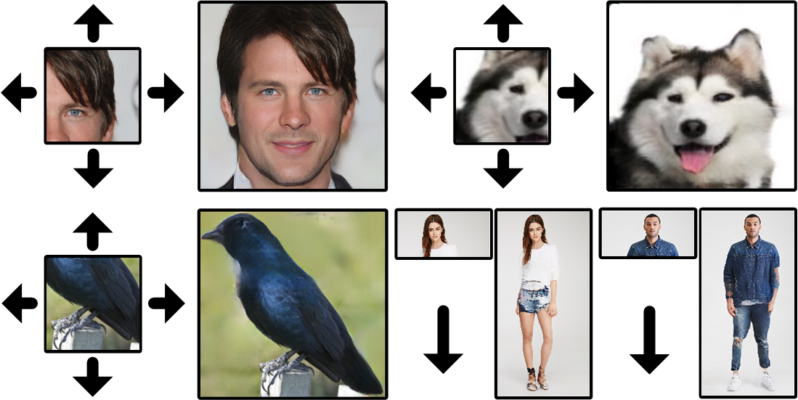

## Partial Results
### Faces
<p>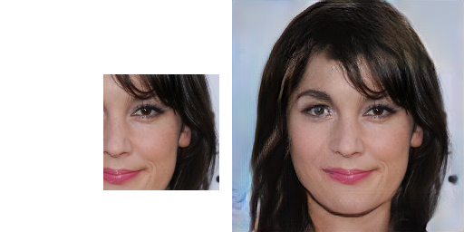 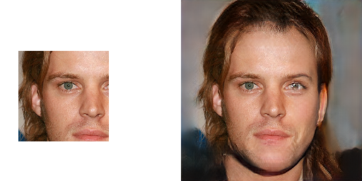 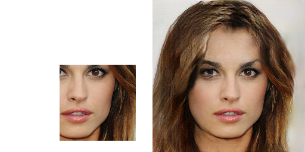 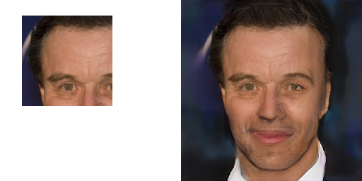</p>

<p>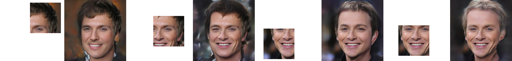</p>

<p>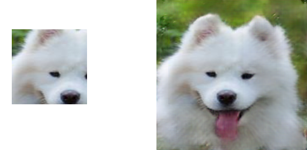 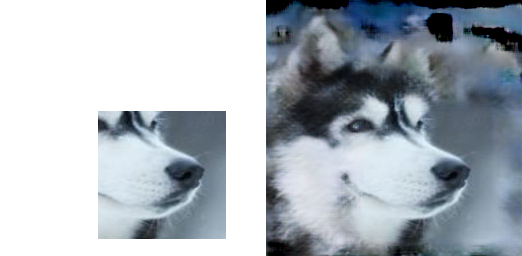 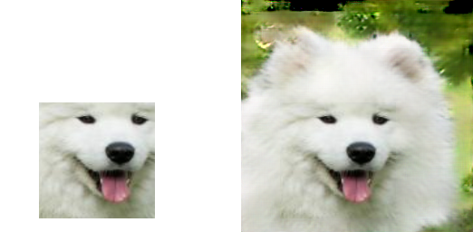 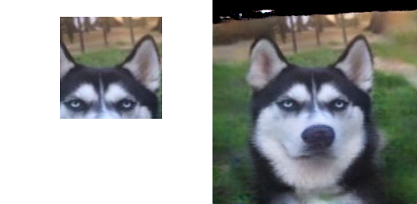</p>

### Bodies
<p>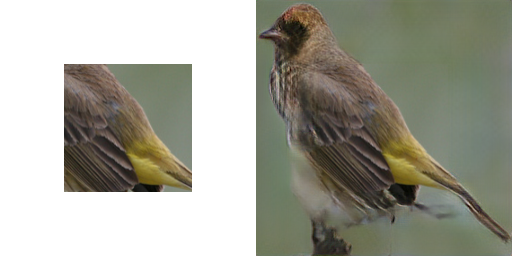  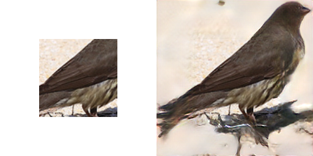 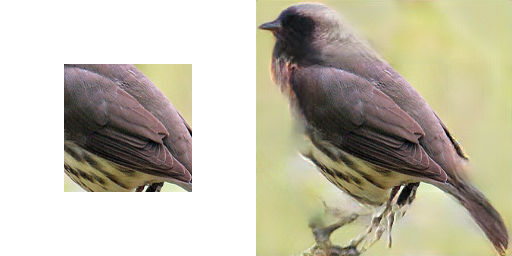</p>

<p>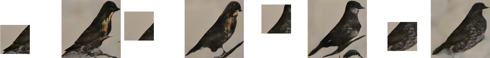</p>

<p>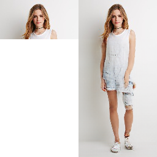 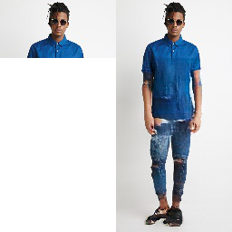 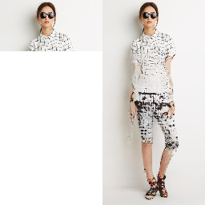 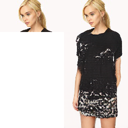 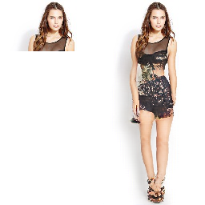 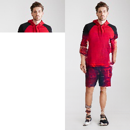</p>

### Scenes
<p>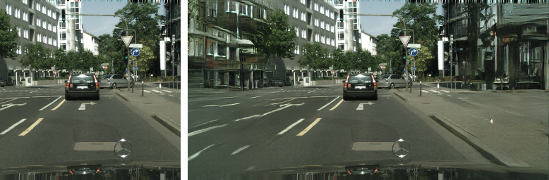 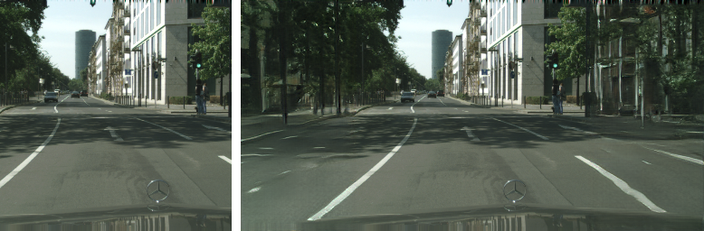</p>

<p>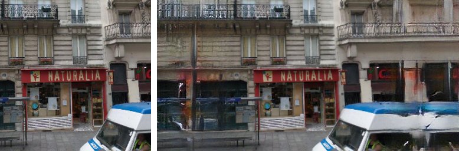 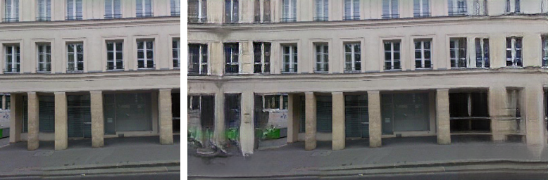</p>

<p> </p>

### [More results](https://drive.google.com/file/d/1r9YUkrsT35_EtAMiS4v6yal6Hl2GGH3o/view?usp=sharing)

## Network structure

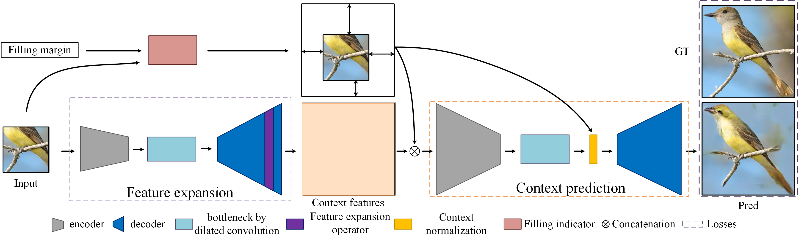

### Key components
- Small-to-large scheme
- Context normalization
- Relative spatial variant loss

## Prerequisites
- Python3.5 (or higher)
- Tensorflow 1.6 (or later versions, excluding 2.x) with NVIDIA GPU or CPU
- OpenCV
- numpy
- scipy
- easydict

## Installation

```bash
git clone https://github.com/shepnerd/outpainting_srn.git
cd outpainting_srn/
```

## Testing

- Download the pretrained model through the following link ([CelebA-HQ_256](https://drive.google.com/drive/folders/1q8LhVV6oFaqhWABf10lHzkPONJVO7tWr?usp=sharing)), and unzip and put them into `checkpoints/`. 
- To test images in a folder, we call `test.py` with the opinion `--dataset_path` and `--load_model_dir`. We give some CelebA-HQ_256 examples in the `imgs/celebahq-256/`. For example:

  ```bash
  python test.py --dataset celebahq-256 --data_file ./imgs/celebahq-256/ --load_model_dir ./checkpoints/celebahq-srn-subpixel --random_mask 1
  ```
  or write / modify `test.sh` according to your own needs, then execute this script as (Linux platform):  
  ```bash
  sh ./test.sh
  ```
The visual evaluations will be saved in the folder `./test_results/`.

## Training
- Training the model with the reconstruction loss (relative spatial variant loss) firstly (set the opinion `--pretrain_network 1`), then fine-tuning the model with all losses (`--pretrain_network 0` and `--load_model_dir [Your model path]`) after the first stage converges.
To pretrain the network,
  ```shell
  python train.py --dataset [DATASET_NAME] --data_file [DATASET_TRAININGFILE] --gpu_ids [NUM] --pretrain_network 1 --batch_size 16
  ```
  where `[DATASET_TRAININGFILE]` indicates a file storing the full paths of the training images. A simple example is given as:
  ```shell
  python train.py --dataset celebahq-256 --data_file ../celebahq-256_train.txt --gpu_ids 0 --img_shapes 256,256 --pretrain_network 1 --batch_size 8
  ```

- Then finetune the network,
  ```shell
  python train.py --dataset [DATASET_NAME] --data_file [DATASET_TRAININGFILE] --gpu_ids [NUM] --pretrain_network 0 --load_model_dir [PRETRAINED_MODEL_PATH] --batch_size 8
  ```

### Datasets
All used datasets ([CelebA-HQ](https://github.com/tkarras/progressive_growing_of_gans), [CUB200](http://www.vision.caltech.edu/visipedia/CUB-200.html), [Dog](https://github.com/HsinYingLee/DRIT/tree/master/datasets), [DeepFashion](http://mmlab.ie.cuhk.edu.hk/projects/DeepFashion/InShopRetrieval.html), [Paris-Streetview](https://github.com/pathak22/context-encoder), [Cityscape](https://www.cityscapes-dataset.com/), and [Places2](http://places2.csail.mit.edu/download.html)) and their corresponding train/test splits are given in the paper.

### Todo
- [ ] Other pretrained models
- [ ] ...

## Disclaimer
- The training and evaluation performance on large-scale datasets (with a variety of categories) is unstable due to possible mode collapse in adversarial training.
- The used ID-MRF is a simplified version based on [contextual loss](https://github.com/roimehrez/contextualLoss). The step of excluding `s` is omitted for computational efficiency.

## Citation

If our method is useful for your research, please consider citing:

    @inproceedings{wang2019srn,
      title={Wide-Context Semantic Image Extrapolation},
      author={Wang, Yi and Tao, Xin and Shen, Xiaoyong and Jia, Jiaya},
      booktitle={IEEE Conference on Computer Vision and Pattern Recognition (CVPR)},
      year={2019}
    }

    @inproceedings{wang2018image,
      title={Image Inpainting via Generative Multi-column Convolutional Neural Networks},
      author={Wang, Yi and Tao, Xin and Qi, Xiaojuan and Shen, Xiaoyong and Jia, Jiaya},
      booktitle={Advances in Neural Information Processing Systems},
      pages={331--340},
      year={2018}
    }

## Acknowledgments
Our code is built upon [Image Inpainting via Generative Multi-column Convolutional Neural Networks](https://github.com/shepnerd/inpainting_gmcnn) and [pix2pixHD](https://github.com/NVIDIA/pix2pixHD).

## [Recent related work](https://github.com/shepnerd/inpainting_gmcnn)

### Contact

Please send email to yiwang@cse.cuhk.edu.hk.
